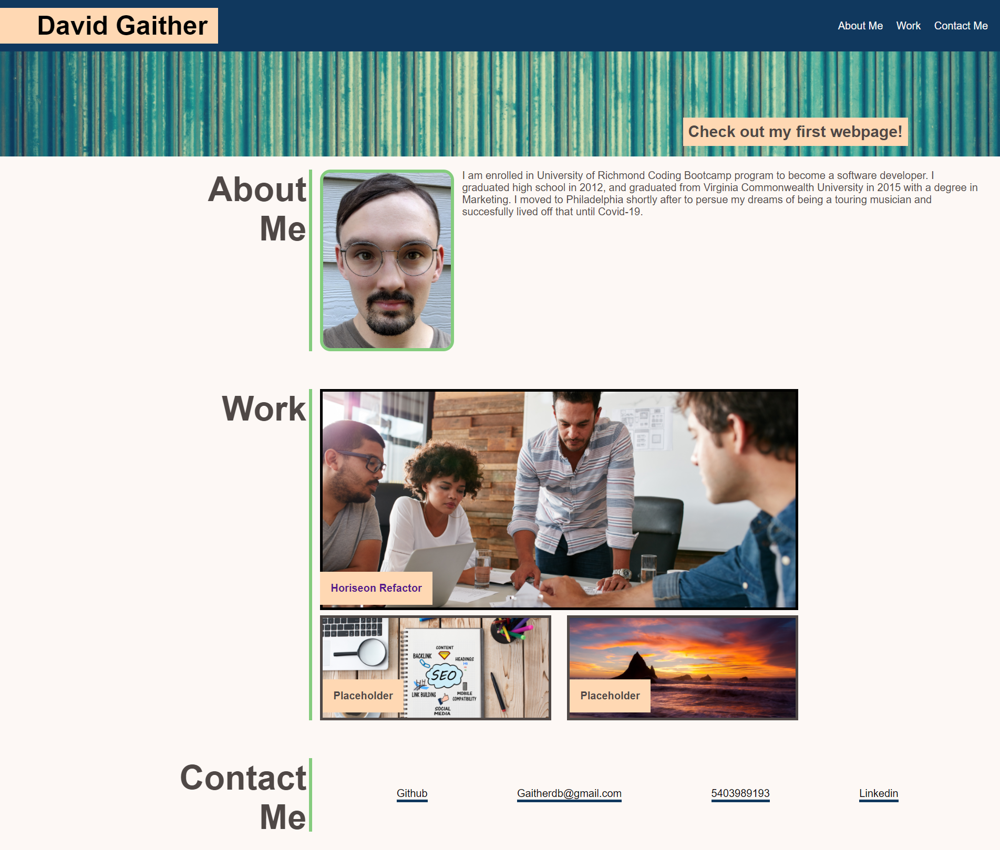

# My Portfolio

This is my first webpage that I have created.

## Functionality

This webpage acts as a portfolio for myself, David Gaither. 

It includes three sections: About Me, Work, & Contact Me. 
The nav bar links allow you to automatically scroll to the desired section. 

The Work section provides images representing coding projects that I have worked on.
The first and larger image, Horiseon Refractor, links to my first homework assignment when the image is clicked.

The Contact Me section has a list of links that allow you to contact me and allows you to view personal webpages that represent me.

## Aditional Info

Deployed [Portfolio](https://gaitherdb.github.io/Portfolio1/) site on Github.

* This webpage was made using flexboxes and flex properties to help position the content and to help it adjust to different media screen sizes.
* Media screen sizes adjust according to these sizes: 992px+, 577px - 991px, & 576px and below. 
* Some text and images highlight when hovered.
* Alt tags are provided for images to help users that use disability extentions.

**Version 1.0**

